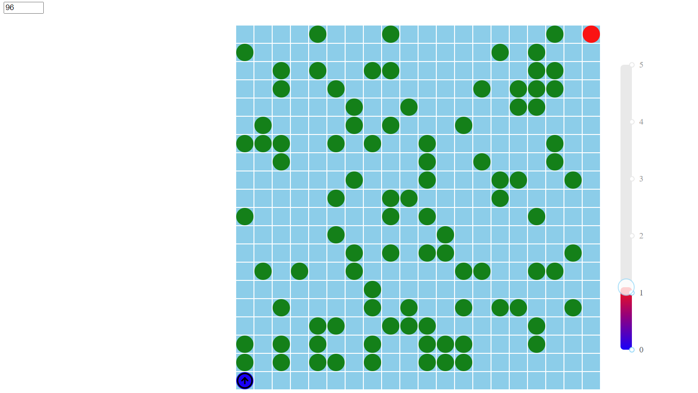

# vite-react-typescript-template

Vite React Typescript template for simple web frontend project.



## Tasks

Build a simple frog jumping game with React.

- UI configuration
  - Create 20x20 grid(Lake) at initial status
  - Setup an input box for specifying the number of leaves on the lake
  - When Start button is clicked, the relevant number of leaves should be placed on the lake (Leaf should be green circle inside the cell)
  - Frog starts from the bottom left cell of the lake (blue circle) and frog should go to the top right cell of the lake (red circle)
  - Frog should look like an arrow indicating the direction
- When Left or Right arrow key is pressed, the frog should rotate 90 degress in the relevant direction
- When Space key is presses, the power control components starts running. It's indicating the number of steps(0~5)
- When Frog is arrived to the target, notify "Win the game", if the Frog can't go to the target in any cases, then notify "Hopeless Game"

## Environment

- Windows 11
- Node v20.15.1
- Npm 10.7.0

## Tech Stacks

- Vite + React + Typescript

## Steps to run program

1. Install node modules

   ```shell
   npm install
   ```

2. Run project
   ```shell
   npm run dev
   ```
   This will host the project on http://localhost:5173.
